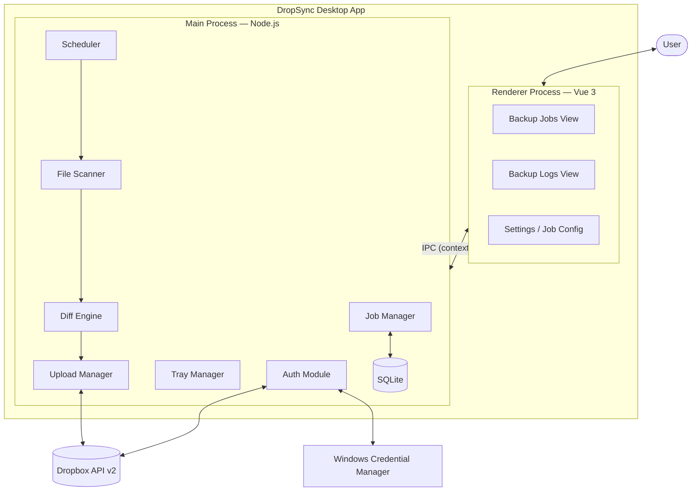
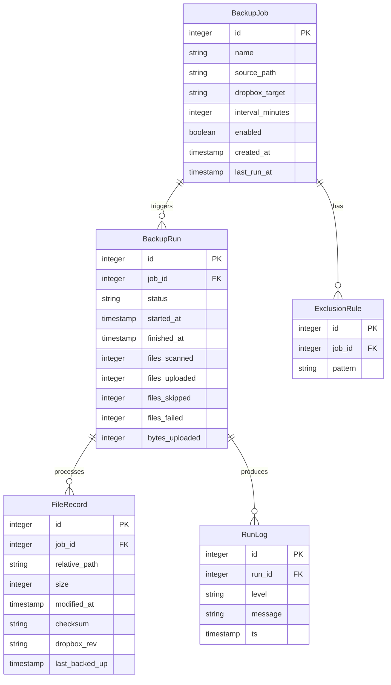

# Architecture: DropSync

## 1. Introduction

**Purpose.** This document describes the technical architecture of DropSync, a Windows desktop application that provides incremental, scheduled backups of local folders to Dropbox. It is the primary engineering reference for the project.

**Source PRD.** DropSync PRD v1.0

**Audience.** Engineering team, technical reviewers, future maintainers.

**Status.** Draft — pending review.

**Project tier.** Small. This document uses Tier 1 sections only, with related topics folded together where a separate section would add weight without clarity.

## 2. Architectural Goals and Constraints

### Goals
- **Reliability.** Backups must complete correctly or fail visibly — never silently lose data or leave inconsistent state.
- **Simplicity.** A non-technical user should be able to configure and forget. Every screen self-explanatory.
- **Incremental efficiency.** Only changed files are uploaded, respecting the user's bandwidth and Dropbox quota.
- **Unobtrusive operation.** Runs in the system tray; only surfaces when the user wants it or something goes wrong.
- **Resumability.** Long backups must survive app restarts and network interruptions.

### Non-Goals
- Real-time or continuous sync (Dropbox's own client covers this)
- macOS, Linux, or mobile support
- Multi-cloud support (Google Drive, OneDrive)
- File versioning or point-in-time restore
- Encryption beyond what Dropbox provides natively
- Enterprise features (multi-user, centralised management, compliance)

### Hard Constraints
- Must use Dropbox API v2 — no dependency on the Dropbox desktop app
- Windows only
- Requires internet connection for backup operations
- Subject to Dropbox API rate limits and user's storage quota
- Open-source portfolio project — no paid services or proprietary dependencies

### Quality Attributes (ranked)
1. **Reliability / data integrity** — backups must be correct above all else
2. **Simplicity / usability** — non-technical users must succeed without guidance
3. **Efficiency** — skip unchanged files, respect bandwidth and quota
4. **Maintainability** — solo developer must be able to evolve the codebase
5. **Performance** — large folder sets should remain usable, but correctness comes first

## 3. High-Level Architecture

DropSync is a single Electron desktop application with a clear separation between the Vue renderer process and the Node.js main process. There is no backend service.

**Communication patterns.**
- **Renderer ↔ Main:** Electron IPC via `contextBridge` / `preload`. Renderer sends commands (create job, trigger backup, fetch logs); Main pushes progress events back. No shared state — the renderer holds no domain truth.
- **Within Main process:** Synchronous function calls. The Scheduler triggers the pipeline: Scanner → Diff Engine → Upload Manager. No message bus — unnecessary for a single-process app.
- **Main ↔ Dropbox:** Asynchronous HTTPS requests. Upload Manager handles batching, retries, and rate-limit backoff.
- **Main ↔ SQLite:** Synchronous transactional writes via `better-sqlite3`. State saved per backup checkpoint, not per file.

**Why this decomposition.** Electron naturally separates renderer and main processes. All domain logic lives in the main process so it can run headlessly (testable without UI) and continue operating when minimised to tray. The renderer is a thin view layer — it renders state from Main and dispatches user actions back.

### Components at a glance

| Component | Responsibility |
|---|---|
| **Vue Renderer** | All UI — job list, log viewer, job configuration. No domain logic. |
| **Job Manager** | CRUD for backup job configurations in SQLite |
| **Scheduler** | Interval-based timer; triggers backup runs per job schedule |
| **File Scanner** | Walks source directories, applies .gitignore-style exclusion rules |
| **Diff Engine** | Compares scanned files against last-known state to find new, changed, and deleted files |
| **Upload Manager** | Uploads changed files to Dropbox; handles batching, retries, resumable sessions for large files |
| **Auth Module** | OAuth 2.0 PKCE flow, token refresh, credential storage |
| **Tray Manager** | System tray icon, context menu, minimize-to-tray behaviour |
| **SQLite** | Job config, file state tracking, backup run logs, encrypted token reference |

## 4. Data Architecture

### Data Model

### Database Strategy

**Single embedded SQLite database.** A single-user desktop app has no need for a database server, replication, or polyglot persistence. SQLite provides transactional safety, zero-config deployment, and is well-suited for the write-light, read-moderate workload of a backup utility.

Database location: `%APPDATA%/dropsync/dropsync.db`

### Data Flow

1. User creates a backup job → `BackupJob` + `ExclusionRule` rows inserted
2. Scheduler fires at the configured interval → `BackupRun` row created with `status: running`
3. File Scanner walks source directory, applying exclusion rules
4. Diff Engine compares scanned files against `FileRecord` state from last backup → identifies new, changed, deleted
5. Upload Manager uploads changed files to Dropbox → `FileRecord` rows upserted with new checksum, size, `dropbox_rev`
6. `BackupRun` row updated with final counts and `status: completed` or `status: failed`
7. `RunLog` entries written throughout for the Logs view

### Caching Strategy

- **FileRecord is the cache.** Once a file is backed up, its size, modified time, and checksum are stored. On the next run, unchanged files are skipped by comparing these fields — no re-upload, no re-hash.
- **No in-memory cache layer.** SQLite handles the workload directly. Adding an in-memory layer would be unjustified complexity for a single-user app.

### Data Lifecycle

- Job config retained until the user deletes the job
- FileRecord state retained as long as the job exists — enables incremental detection across runs
- BackupRun and RunLog retained indefinitely (small footprint, valuable for user confidence); a future "clear old logs" feature could prune runs older than N days
- All DropSync data removed on uninstall; backed-up files in Dropbox are unaffected

### Data Ownership

The user owns all data. DropSync stores only metadata locally — actual file content lives in the user's Dropbox account.

## 5. Technology Stack

| Layer | Choice | Rationale |
|---|---|---|
| App shell | **Electron** | Cross-platform desktop shell with mature Windows support; aligns with PRD requirement. Large community, well-documented tray/IPC APIs. |
| Renderer | **Vue 3 + Vite** | User's preferred framework. Composition API keeps components lean. Vite provides fast HMR during development. |
| Main process | **Node.js** | Electron's native runtime. Direct access to filesystem APIs, child processes, and the full npm ecosystem. |
| Database | **better-sqlite3** | Synchronous, fast, zero-config embedded SQLite. Simpler than sql.js for an Electron main process where native modules are acceptable. |
| Dropbox client | **Hand-written over `axios`** | Official Dropbox JS SDK exists but is heavy and opinionated. A thin wrapper over `axios` gives full control over retries, upload sessions, and rate-limit handling. |
| File hashing | **Node.js `crypto` (built-in)** | MD5/SHA-256 for change detection. No external dependency needed. |
| Glob/exclusion | **`minimatch` or `ignore`** | Proven .gitignore-style pattern matching. Small, well-tested libraries. |
| Token storage | **`keytar`** | Cross-platform OS credential store access. On Windows, uses Credential Manager. |
| Build/package | **electron-builder** | Standard Electron packaging for Windows installers (.exe, .msi). |
| UI styling | **CSS (plain or utility framework)** | No heavy component library needed for a simple dashboard UI. Tailwind CSS optional if preferred. |

### Rejected Alternatives

| Alternative | Why rejected |
|---|---|
| **Tauri** | Smaller binaries, but requires Rust expertise. Electron is a better fit for a portfolio project with Vue and Node.js skills. |
| **React / Svelte** | Viable, but Vue is the user's preference. |
| **Dropbox official SDK** | Adds weight and abstraction; doesn't support fine-grained control over upload sessions and retry logic. |
| **sql.js** | Pure JS SQLite (WASM-based). Works but slower and more awkward than `better-sqlite3` in a Node.js main process where native modules are fine. |
| **nedb / lowdb** | Simpler, but lack transactional safety needed for reliable backup state tracking. |

### Known Risks

- **Electron binary size** — ~150MB+ base. Acceptable for a desktop utility; not ideal but no lighter alternative without giving up Node.js.
- **better-sqlite3 native module** — requires rebuild for Electron's Node version. `electron-rebuild` handles this, but adds a build step.
- **keytar maintenance** — the library is in maintenance mode. If it becomes unusable, fallback is `electron-store` with encrypted values (less secure but functional).

## 6. Key Design Decisions

### ADR-001: Electron over Tauri

- **Context.** Need a desktop shell for a Windows backup utility with a Vue UI.
- **Decision.** Use Electron.
- **Alternatives.** Tauri (smaller binaries, Rust core), .NET MAUI + WebView, plain Node.js CLI with no GUI.
- **Consequences.** Larger binary size (~150MB+) and higher memory baseline. In return: mature ecosystem, no Rust learning curve, straightforward Vue integration, and extensive documentation — all important for a portfolio project on a short timeline.

### ADR-002: Incremental Detection via File Metadata First, Checksum Second

- **Context.** The Diff Engine must decide which files have changed since the last backup. Checksumming every file is correct but slow for large folder sets.
- **Decision.** Compare file size and modified timestamp first. Only compute a checksum when size and timestamp match but the user has enabled "strict mode" (off by default).
- **Alternatives.** Always checksum (slow for large sets); only metadata (misses rare same-size-same-timestamp changes).
- **Consequences.** Fast default path. Extremely rare edge case where a file changes content without changing size or timestamp — acceptable for a casual backup tool, and covered by the opt-in strict mode.

### ADR-003: Upload Sessions for Large Files

- **Context.** Dropbox API single-upload endpoint has a 150MB limit. Users may back up large files (videos, archives).
- **Decision.** Files under 150MB use single upload. Files at or above 150MB use Dropbox upload sessions (chunked, resumable).
- **Alternatives.** Always use upload sessions (simpler code path but unnecessary overhead for small files); reject large files (poor UX).
- **Consequences.** Two code paths in the Upload Manager. Upload sessions add complexity but are necessary for correctness and resumability on large files.

### ADR-004: SQLite for All Persistent State

- **Context.** Need to store job config, file state, and run logs. Multiple options: flat files, electron-store (JSON), SQLite.
- **Decision.** Single SQLite database for everything.
- **Alternatives.** electron-store for config + SQLite for file state (split storage); JSON files (no transactional safety).
- **Consequences.** One storage mechanism to understand and maintain. Transactional writes protect against corruption on crash mid-backup. Slight overhead for simple config reads, but negligible.

### ADR-005: Deleted Source Files Are Preserved in Dropbox by Default

- **Context.** When a file is deleted locally, should the backup delete it from Dropbox too?
- **Decision.** Default behaviour: preserve. Deleted local files are not removed from the Dropbox backup. A future "mirror mode" setting could opt into deletion.
- **Alternatives.** Always mirror deletions (risks accidental data loss); ask per-run (annoying).
- **Consequences.** Dropbox backup grows over time as a superset of all files ever backed up. This is safer and simpler — aligns with the PRD principle "reliability over speed" and "no surprises."

## 7. Security Architecture

### Authentication Mechanism

**OAuth 2.0 with PKCE** against Dropbox. DropSync has no user accounts of its own — Dropbox is the sole identity authority. The app registers as a public OAuth client (no client secret). Refresh tokens are obtained during the initial auth flow and used to acquire short-lived access tokens on demand.

### Authorisation Model

**Single-user, single-tenant.** All authorisation is delegated to Dropbox: DropSync can only access folders the user has authorised via the OAuth scope. There is no internal RBAC — there are no internal users or roles.

### Data Encryption

- **At rest:** OAuth refresh tokens stored in Windows Credential Manager via `keytar` — encrypted by the OS. The SQLite database contains only file metadata (paths, sizes, timestamps, checksums) — non-sensitive and stored in cleartext.
- **In transit:** TLS 1.2+ for all Dropbox API traffic, enforced by `axios` / Node.js defaults. No custom certificate handling.

### Secrets Management

| Secret | Storage | Rotation |
|---|---|---|
| OAuth refresh token | Windows Credential Manager via `keytar` | Rotated by Dropbox on refresh; app stores the latest automatically |
| OAuth access token | In-memory only, never persisted | Short-lived; refreshed on expiry or 401 |
| OAuth client secret | None — public client using PKCE | N/A |
| SQLite database | No encryption — contains no secrets | N/A |

### Security Boundaries and Trust Zones

| Boundary | What crosses | What's validated |
|---|---|---|
| Renderer ↔ Main (IPC) | Typed commands and events via contextBridge | Preload script exposes only a defined API; renderer cannot access Node.js directly |
| Process ↔ Disk | SQLite state, file metadata | No secrets in SQLite; tokens in OS credential store |
| Process ↔ Network | Dropbox API traffic only | TLS enforced; only the Auth Module and Upload Manager make outbound requests |
| Process ↔ OS credential store | Refresh token | OS-mediated access; standard Windows Credential Manager |

### Electron-Specific Hardening

- **Context isolation enabled** — renderer runs in a sandboxed context, no direct `require()` or Node.js access
- **`nodeIntegration: false`** — enforced in BrowserWindow config
- **Preload script** — exposes a minimal, typed API surface via `contextBridge.exposeInMainWorld`
- **No remote content** — renderer loads only local files; no external URLs loaded in the webview

### Compliance

No specific regulatory compliance applies. DropSync stores no PII beyond file paths and names, which remain local to the user's machine.

## 8. Open Questions and Risks

### Open Questions

- **Default backup interval.** The PRD suggests options (1h, 6h, 24h) but doesn't specify a default. Recommendation: 6 hours — frequent enough to be useful, infrequent enough to not annoy. Needs user testing.
- **Maximum practical folder size.** The File Scanner and Diff Engine need to handle large folder trees. What's the upper bound we test for — 100k files? 500k? Determines whether we need streaming SQLite reads or can load file state into memory.
- **Default exclusion patterns.** Should the app ship with a built-in set (`node_modules`, `.git`, `__pycache__`, `*.tmp`, `Thumbs.db`)? Users can always modify, but sensible defaults reduce setup friction.
- **Auto-start with Windows.** Should DropSync register itself to start on login by default, or is that opt-in during setup?
- **Handling of locked/open files.** Windows frequently locks files that are in use. Skip with a warning? Retry once? Log and move on?
- **Dropbox app approval.** The OAuth app needs Dropbox review for production scopes. Timeline and requirements should be confirmed early.

### Known Risks

| Risk | Impact | Likelihood | Mitigation |
|---|---|---|---|
| Dropbox API rate limiting on large backups | Backup stalls or fails mid-run | Medium — depends on library size | Exponential backoff with jitter; chunked uploads; respect `Retry-After` headers |
| User exceeds Dropbox quota mid-backup | Partial backup, confusing state | Low–Medium | Pre-check available space before starting; warn if estimated upload exceeds free space |
| `better-sqlite3` native module rebuild issues | Build fails on some Electron versions | Low | Pin versions; `electron-rebuild` in postinstall; fallback to `sql.js` if persistent |
| `keytar` deprecated or breaks on future Windows versions | Token storage fails | Low | Monitor library status; fallback plan is `electron-store` with user-scoped encryption |
| App crash mid-backup leaves incomplete state | User unsure what was backed up | Medium | Transactional SQLite writes per checkpoint; `BackupRun.status` stays `running` until explicitly completed; resume logic on next run |
| File permissions or locked files on Windows | Scanner errors, incomplete backup | Medium | Catch and log per-file errors; continue scan; surface failures in run log |

### Spikes Needed Before Implementation

1. **Dropbox upload session flow** — build a minimal proof-of-concept for chunked resumable uploads to validate the API behaviour and error handling before building the full Upload Manager.
2. **Large folder performance** — scan a 100k+ file directory tree and measure Scanner + Diff Engine time to confirm the metadata-first approach is fast enough without streaming.

---

## What this document deliberately omits

For transparency, the following Tier 2/3 sections were considered and excluded:

- **System Context as a separate section** — folded into High-Level Architecture; DropSync's context is simple enough that a separate section would repeat it.
- **Component Detail as a separate section** — the components-at-a-glance table in Section 3 is sufficient at this scale.
- **API Design** — DropSync exposes no programmatic API. The only interface is the Electron IPC channel, documented in Section 3.
- **Integration Points** — there is exactly one integration (Dropbox), already covered in Sections 3, 5, and 7.
- **Infrastructure and Deployment** — this is a desktop app distributed as a Windows installer. There are no servers, containers, or environments to document.
- **Cross-Cutting Concerns** — error handling is covered in ADR context and failure modes; configuration is a single SQLite database; no i18n or accessibility requirements in the PRD.
- **Performance and Scalability** — single-user desktop app. Performance targets are implicit in the design (metadata-first diffing, chunked uploads). An open question covers the large-folder-size boundary.
- **Failure Modes and Resilience** — covered within the Known Risks table and ADR-004/ADR-005.
- **Formal Threat Model** — Security Architecture (Section 7) covers the threats relevant to a single-user offline app.
- **Evolution and Future Considerations** — no committed V2 scope. Speculating would violate YAGNI.

These omissions are deliberate, not accidental. If the project grows in scope, these sections should be added at that time.

---

## References

- [Dropbox API v2 Documentation](https://www.dropbox.com/developers/documentation/http/documentation)
- [Electron Security Checklist](https://www.electronjs.org/docs/latest/tutorial/security)
- C4 model for software architecture
- Lightweight ADR (Architecture Decision Record) format
- YAGNI principle ("You Aren't Gonna Need It")
