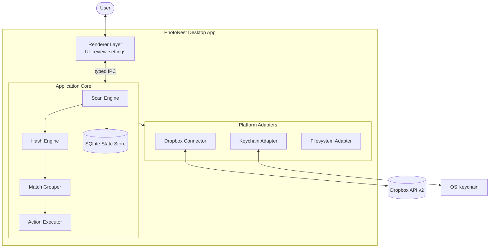
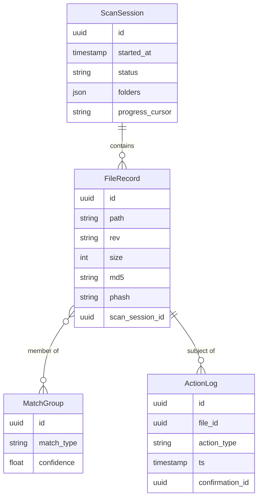

# Architecture Skill

## Overview

This skill takes a completed PRD as input and produces a comprehensive `architecture.md` file for the project. It works by simulating a senior architecture review session — surfacing decisions, trade-offs, and constraints that the PRD only hints at — and capturing them in a form that engineering can build from directly.

The skill is designed to:
- Translate product intent into technical structure
- Make architectural decisions explicit and reviewable
- Surface trade-offs rather than hide them
- Document the *why*, not just the *what*
- Produce a living document that evolves with the system
- **Match its own weight to the project's actual complexity**

This skill is suitable for:
- New projects entering build phase
- Major rewrites or re-architectures
- Onboarding documentation for complex systems
- Pre-implementation review with stakeholders

---

## Inputs

The skill expects:
1. **A completed PRD** (preferably one produced via the PRD skill)
2. **User-provided constraints**, such as:
   - Required or preferred technology stack
   - Deployment target (cloud provider, on-prem, desktop, hybrid)
   - Team size and skill profile
   - Budget or licensing constraints
   - Existing systems to integrate with
   - Compliance or regulatory requirements
3. **Project size signal** — small (single-purpose tool, 1–2 devs), medium (multi-component product, small team), or large (multi-team platform, multiple integrations, regulated environment)

If any of these are missing, the skill should ask targeted questions before drafting.

---

## Guidelines

- **Decisions over descriptions.** Every significant choice should be recorded with the alternatives considered and the reason for the choice.
- **Diagrams where they help, prose where they don't.** Don't draw a diagram of three boxes; do draw one for a non-obvious data flow.
- **Match depth to risk.** A well-understood CRUD endpoint needs a paragraph; a novel sync algorithm needs a section.
- **Be honest about unknowns.** If something is undecided, mark it clearly. Don't paper over gaps.
- **Avoid technology-as-decoration.** Every named library, framework, or service must earn its place by solving a stated problem.
- **Write for the next engineer.** Assume the reader is competent but unfamiliar with this specific project.
- **Resist YAGNI violations.** Do not document, abstract, or build for futures that aren't on the immediate roadmap.

### Role-Based Thinking

Each section should reflect the perspective of the relevant role:

**Solutions Architect** — overall structure, integration boundaries, technology selection
**Engineering Lead** — implementability, complexity, team fit
**Security Engineer** — threat model, data protection, access control
**Site Reliability Engineer** — failure modes, observability, recovery
**Data Engineer** — data model, storage, lifecycle
**Product Manager** — alignment with PRD goals and constraints

---

## Working Process

### When creating a new architecture document
- Ask about the project's scale and complexity first — a weekend prototype and a multi-team platform deserve very different documents
- Tailor recommendations to the project size; do not over-architect
- Explain trade-offs for each technology choice rather than presenting decisions as obvious
- Work through the document one section at a time, confirming with the user before moving on
- Use diagrams expressed in text (Mermaid syntax) where they help comprehension
- Save the document incrementally as each section is approved, rather than producing the entire document in one pass

### When refining an existing architecture document
- Read the entire document first before suggesting any changes
- Check for consistency between sections (e.g. components mentioned in the high-level view should appear in component detail)
- Identify missing sections or gaps relative to the standard structure
- Suggest modern alternatives where appropriate, but explain the migration cost
- Wait for explicit user approval before making changes — never edit silently

---

## Section Sizing Guide

Not every project needs every section. Match the document's weight to the project's complexity. When in doubt, prefer fewer sections — adding a section later is easier than convincing readers to keep going through a 40-page document.

### Tier 1 — Always include
For any project of any size:
- Introduction
- Architectural Goals and Constraints
- High-Level Architecture *(folds in System Context and Component Detail for small projects)*
- Data Architecture
- Technology Stack
- Key Design Decisions
- Security Architecture
- Open Questions and Risks

### Tier 2 — Include for medium and large projects
- System Context as a separate section
- Component Detail as a separate section
- API Design *(only if the system exposes an API)*
- Infrastructure and Deployment
- Cross-Cutting Concerns
- Integration Points *(only if there is more than one or two integrations)*
- Performance and Scalability
- Failure Modes and Resilience

### Tier 3 — Include only for large or high-stakes projects
- Formal Threat Model
- Evolution and Future Considerations

### Sizing rules of thumb
- **Small project:** 6–10 pages, Tier 1 only, fold related topics together
- **Medium project:** 15–25 pages, Tier 1 + Tier 2
- **Large project:** 30+ pages, all tiers

---

## Output Structure

### 1. Introduction *(Tier 1)*
- Purpose of the document
- Reference to the source PRD
- Intended audience
- Document status (draft, approved, etc.)

### 2. Architectural Goals and Constraints *(Tier 1)*
- Architectural goals derived from the PRD
- Non-goals — what this architecture explicitly does **not** try to solve
- Hard constraints (technical, organisational, regulatory)
- Quality attributes prioritised (performance, security, maintainability, etc.) — **ranked**

### 3. System Context *(Tier 2)*
- A high-level view of the system in its environment
- External actors (users, systems, services)
- System boundary
- Diagram: context diagram (C4 Level 1 equivalent), Mermaid preferred

### 4. High-Level Architecture *(Tier 1)*
- Major components or services and their responsibilities
- **Communication patterns between components** — synchronous calls, asynchronous queues, events, shared state
- How components interact at runtime
- Diagram: container/component diagram (C4 Level 2)
- Reasoning behind the decomposition

### 5. Component Detail *(Tier 2)*
For each significant component:
- Responsibility
- Key interfaces / public surface
- Dependencies (and direction of dependency)
- Internal structure (only where it matters)

### 6. Data Architecture *(Tier 1)*
- **Data model overview** — core entities and relationships
- **Database strategy** — single shared DB, DB per service, CQRS, polyglot persistence — and the rationale
- Storage choices (relational, document, key-value, object store) and why
- **Data flow** — how data moves through the system from creation to consumption
- **Caching strategy** — what's cached, where, invalidation approach
- Data lifecycle (creation, retention, deletion)
- Data ownership and access patterns

### 7. API Design *(Tier 2 — only if the system exposes an API)*
- **API style** — REST, GraphQL, gRPC, JSON-RPC, message-based — and why
- **Authentication and authorisation approach** — how API consumers authenticate, how scopes/permissions work
- **API versioning strategy** — URI, header, content negotiation; deprecation policy
- **Rate limiting and throttling** — per-client limits, burst handling, backpressure
- Error contract and conventions
- Pagination, filtering, sorting conventions
- Public vs internal API distinction

If the system exposes no API, include this section as a single sentence stating "N/A — system exposes no programmatic API" and a one-line reason. The explicit N/A is itself useful information.

### 8. Technology Stack *(Tier 1)*
- Language, framework, and major library choices
- Rationale for each significant choice
- Alternatives considered and rejected
- Known risks of the chosen stack

### 9. Key Design Decisions *(Tier 1)*
Numbered list of significant decisions in lightweight ADR format:
- **Context** — what problem prompted the decision
- **Decision** — what was chosen
- **Alternatives** — what else was considered
- **Consequences** — trade-offs accepted

Only record decisions that were genuinely contested or that future maintainers would otherwise question. Routine choices do not need ADRs.

### 10. Security Architecture *(Tier 1)*
- **Authentication mechanism** — JWT, OAuth 2.0, SAML, session cookies, mTLS — and rationale
- **Authorisation model** — RBAC, ABAC, ReBAC, capability-based — and where authorisation decisions are made
- **Data encryption** — at rest (algorithm, key management) and in transit (TLS version, cipher policy)
- **Secrets management** — where secrets live, how they rotate, who can access them
- **Security boundaries and trust zones** — what crosses each boundary, what's validated at each
- Compliance considerations where applicable

For Tier 3 projects, this section is supplemented by a separate Threat Model.

### 11. Infrastructure and Deployment *(Tier 2)*
- **Deployment architecture** — containers, VMs, serverless, desktop binaries — and why
- **Environment strategy** — dev, staging, production; promotion process; environment parity
- **CI/CD pipeline overview** — build, test, deploy stages; gating
- **Monitoring and observability** — logging, metrics, tracing, alerting
- **Disaster recovery and backup strategy** — RPO, RTO, restore tests
- Hosting / runtime topology
- Diagram: deployment diagram if non-trivial

### 12. Cross-Cutting Concerns *(Tier 2)*
For concerns not covered by the dedicated sections above:
- **Privacy** — data minimisation, user controls
- **Error handling** — how failures propagate, surface, recover
- **Configuration management** — how config flows through environments
- **Internationalisation, accessibility** — where applicable

### 13. Integration Points *(Tier 2 — only if multiple integrations)*
For each external system integration:
- Protocol and contract
- Authentication
- Failure handling
- Rate limits and quotas
- Versioning strategy

For a single integration, fold this into Component Detail or High-Level Architecture instead.

### 14. Performance and Scalability *(Tier 2)*
- **Expected load and growth projections** — concrete numbers, not "high"
- **Performance targets and SLAs** — latency, throughput, availability — measurable and per-operation where it matters
- **Scaling strategy** — horizontal, vertical, sharding, read replicas
- **Bottleneck analysis** — where the system is expected to hit limits first

### 15. Failure Modes and Resilience *(Tier 2)*
- What can go wrong, and what happens when it does
- Degraded modes
- Recovery procedures
- Data loss boundaries

### 16. Threat Model *(Tier 3)*
- Trust boundaries (deeper than the Security Architecture summary)
- Top threats (e.g. STRIDE)
- Mitigations
- Open security questions

### 17. Open Questions and Risks *(Tier 1)*
- Unresolved architectural questions
- Known technical risks
- Spikes or proofs-of-concept needed before commitment

### 18. Evolution and Future Considerations *(Tier 3)*
- How the architecture is expected to grow
- Extension points designed in *(only those justified by near-term roadmap items)*
- Things deliberately deferred
- Known migration paths for likely future needs

⚠ **YAGNI warning.** This section is optional and easily abused. Do not document extension points for futures that are not on the roadmap. Do not abstract for V2 cloud providers when V1 only supports one. The presence of this section in the standard structure does not mean every project needs it.

---

## Quality Bar

A good architecture document must:
- Allow a competent engineer to start implementing without needing to ask "but how?" every five minutes
- Make trade-offs visible and defensible
- Be small enough to be read end-to-end
- Be specific enough to be wrong (vague documents can never be wrong, and that's the problem)
- Survive contact with reality — i.e. be revised as the project learns
- **Match its weight to the project's complexity** — a 40-page architecture for a 2-week tool is a failure mode

---

## Worked Example

The following is a complete `architecture.md` produced from the PhotoNest PRD. PhotoNest is a small/medium project — single-platform desktop app, small team — so the document uses Tier 1 sections plus a few Tier 2 sections where genuinely needed. It deliberately omits a separate Threat Model, Evolution section, and Integration Points section because they would add weight without adding clarity.

---

# Architecture: PhotoNest

## 1. Introduction

**Purpose.** This document describes the technical architecture of PhotoNest, a desktop application that finds and helps users safely remove duplicate photos in Dropbox. It is the primary engineering reference for the project.

**Source PRD.** PhotoNest PRD v1.0

**Audience.** Engineering team, technical reviewers, future maintainers.

**Status.** Draft — pending review.

**Project tier.** Small/medium. This document uses Tier 1 sections plus selective Tier 2 sections.

## 2. Architectural Goals and Constraints

### Goals
- **Safety.** It must be architecturally impossible for the app to permanently delete a photo without explicit user action and a recovery path.
- **Local-first processing.** All image content stays on the user's machine.
- **Resumability.** Long-running scans must survive app restarts, network blips, and Dropbox API hiccups.
- **Cross-platform parity.** Windows and macOS users get the same experience from a single codebase.

### Non-Goals
- Real-time sync or mirroring of Dropbox content
- Photo editing, tagging, or library management
- Server-side processing of any kind
- Mobile platform support
- Multi-cloud support in V1 *(deliberately not architected for; will be revisited if and when V2 is committed)*

### Hard Constraints
- Must use the official Dropbox API v2
- Must run on consumer hardware: 8GB RAM minimum, no dedicated GPU assumed
- Must support libraries up to ~250,000 photos without crashing
- Open-source license required for the hash engine (per PRD trust commitment)

### Quality Attributes (ranked)
1. **Safety / data integrity** — non-negotiable
2. **Reliability** — scans must complete or resume cleanly
3. **Privacy** — no photo content leaves the device
4. **Performance** — large libraries must remain usable
5. **Maintainability** — small team must be able to evolve the codebase
6. **Portability** — Windows + macOS

## 3. High-Level Architecture

PhotoNest is a single desktop application with a clear separation between the rendering layer, the application core, and platform-specific adapters. There is no backend service.

**Communication patterns.**
- **Renderer ↔ Core:** synchronous typed IPC commands plus an asynchronous event stream for progress updates. No shared state — the renderer holds no domain truth.
- **Within the Core:** synchronous function calls. The Scan Engine drives the pipeline; there is no message bus because there is no need for one.
- **Core ↔ Dropbox:** asynchronous HTTPS requests with backpressure managed by the Scan Engine.
- **Core ↔ SQLite:** synchronous transactional writes, batched per scan checkpoint.

**Why this decomposition.** The renderer is intentionally thin so the core can be tested headlessly. Platform adapters are isolated so the Dropbox Connector can be replaced or extended in future without touching the Scan Engine — but this is a *natural* boundary, not a speculative abstraction layer. There is no `CloudProvider` trait until a second provider is actually committed.

### Components at a glance

| Component | Responsibility |
|---|---|
| **Renderer** | All user-facing UI; holds no domain logic |
| **Scan Engine** | Orchestrates a scan from start to finish; resumable via SQLite state |
| **Hash Engine** | Pure hashing functions (MD5 + pHash); standalone library |
| **Match Grouper** | Clusters files by hash distance into match groups |
| **Action Executor** | The only component allowed to mutate Dropbox state |
| **State Store** | SQLite + thin DAL; holds tokens, scan state, hashes, audit log |
| **Dropbox Connector** | OAuth, paginated listing, downloads, rate-limit handling |
| **Keychain Adapter** | OS-native secure storage for the SQLite encryption key |
| **Filesystem Adapter** | Local cache directory; size-capped LRU eviction |

## 4. Data Architecture

### Data Model

### Database Strategy
**Single embedded SQLite database per user profile.** A single-user desktop app has no need for a database server, sharding, CQRS, or polyglot persistence. SQLite gives transactional safety, zero-config deployment, and excellent read performance for the scan-and-review workload.

### Data Flow
1. User connects Dropbox via OAuth → token stored encrypted in SQLite
2. User selects folders → ScanSession row created
3. Scan Engine pages file metadata from Dropbox → FileRecord rows inserted in batches
4. Files streamed locally → Hash Engine computes MD5 and pHash → updated on FileRecord
5. Match Grouper reads hashes → produces MatchGroup rows
6. User reviews matches in UI → confirms deletions
7. Action Executor moves files to `_PhotoNest Trash/` → ActionLog row written

### Caching Strategy
- **Hashes are the cache.** Once computed, a FileRecord with its hashes survives across scans, keyed by Dropbox file `rev`. A re-scan only processes files whose `rev` has changed.
- **Thumbnails** generated on demand from cached image bytes; LRU-evicted when cache exceeds 2GB or files go untouched for 14 days.
- **No in-memory caching layer.** SQLite handles the workload directly; adding Redis or similar would be unjustified complexity.

### Data Lifecycle
- Scan data retained until the user deletes the session
- Image cache auto-evicted by size and age
- Audit log retained indefinitely (small footprint, valuable for trust)
- All PhotoNest state removed on uninstall except photos in Dropbox trash, which the user controls

### Data Ownership
The user owns all data. The app holds no remote copies.

## 5. API Design

**N/A — system exposes no programmatic API.** PhotoNest is a self-contained desktop application with a single human user. There is no public, internal, or inter-process API beyond the typed IPC channel between renderer and core, which is documented in Section 3 rather than as a separate API surface.

If a CLI or background daemon is added in future, this section will be revisited.

## 6. Technology Stack

| Layer | Choice | Rationale |
|---|---|---|
| App shell | **Tauri** | Smaller binaries and lower memory than Electron; Rust core aligns with hash engine performance needs. *Risk: smaller ecosystem — see ADR-001.* |
| Renderer | **TypeScript + React** | Team familiarity; mature component ecosystem |
| Application core | **Rust** | Performance for hashing; strong safety guarantees; single-binary distribution |
| Database | **SQLite via `rusqlite`** | Embedded, transactional, zero-config |
| Image hashing | **`image` + `img_hash` crates** | Pure Rust, no native deps, MIT-licensed |
| Dropbox client | **Hand-written over `reqwest`** | Official SDK is JS-only; thin wrapper gives full control |
| Build / CI | **GitHub Actions** | Free for open source, matrix builds for Win/macOS |
| Code signing | **Apple Developer ID + Windows Authenticode** | Required for trust on both platforms |

### Rejected Alternatives
- **Electron** — works, but 150MB+ binaries and 300MB+ RAM baseline conflict with the "runs on modest hardware" goal
- **Flutter desktop** — viable, but team has no Flutter experience and the Dropbox client would still be hand-rolled
- **Python + Qt** — fast to prototype, but distribution is painful and hashing performance suffers

## 7. Key Design Decisions

### ADR-001: Tauri over Electron
- **Context.** Need a cross-platform desktop shell. Two mainstream options.
- **Decision.** Use Tauri.
- **Alternatives.** Electron, Flutter desktop, native (SwiftUI + WinUI).
- **Consequences.** Smaller, faster app. Smaller ecosystem and fewer ready-made components. Team must learn Rust well enough to maintain the core.

### ADR-002: All-Rust Application Core
- **Context.** Hashing 100k+ images must be fast; the core must be testable headlessly.
- **Decision.** Implement Scan Engine, Hash Engine, Match Grouper, Action Executor, and DAL in Rust.
- **Alternatives.** TypeScript core in the renderer process; Python sidecar.
- **Consequences.** Better performance and a sharp boundary between UI and logic. Higher upfront cost in Rust expertise.

### ADR-003: Two-Stage Delete via Dropbox-Side Trash Folder
- **Context.** PRD demands users cannot lose photos.
- **Decision.** "Delete" moves files into `_PhotoNest Trash/` inside the user's Dropbox. PhotoNest never calls the Dropbox permanent delete endpoint.
- **Alternatives.** Use Dropbox's own deleted-files recovery only; use a recycle bin metaphor only locally.
- **Consequences.** Trash files still consume Dropbox quota — must be communicated clearly. Layered with Dropbox's own 30-day recovery, this gives two safety nets.

### ADR-004: Conservative Default pHash Threshold
- **Context.** Perceptual hashing has a sensitivity dial; aggressive settings find more matches but produce more false positives.
- **Decision.** Default Hamming distance threshold of 5 (out of 64 bits). Always show side-by-side preview before any action.
- **Alternatives.** More aggressive default (8–10) to match more files.
- **Consequences.** Users may miss some near-duplicates with default settings but are very unlikely to be presented with non-matches. The "Find more matches" power-user setting can raise the threshold.

> *Note: An earlier draft of this document included an ADR proposing a `CloudProvider` trait abstraction "in preparation for V2." It has been removed. V2 is not committed; building a multi-provider abstraction now would be speculative work. The Dropbox Connector is a clean module and can be generalised when (and if) a second provider is needed.*

## 8. Security Architecture

### Authentication Mechanism
**OAuth 2.0 with PKCE** against Dropbox. PhotoNest itself has no user accounts — Dropbox is the identity authority. Refresh tokens are stored locally; access tokens are obtained on demand.

### Authorisation Model
**Single-user, single-tenant.** All authorisation is delegated to Dropbox: PhotoNest can only access folders the user has authorised. There is no internal RBAC because there are no internal users or roles.

### Data Encryption
- **At rest:** OAuth refresh tokens encrypted in SQLite using AES-256-GCM. Encryption key stored in OS keychain. All other data (file metadata, hashes) is non-sensitive and stored in cleartext.
- **In transit:** TLS 1.2+ for all Dropbox API traffic, enforced by `reqwest` defaults. Certificate pinning not used — relying on the system trust store is appropriate for this threat model.

### Secrets Management
- **OAuth client secret** — none. PhotoNest is a public client and uses PKCE rather than a confidential client secret.
- **Refresh tokens** — encrypted in SQLite with key in OS keychain (Keychain on macOS, Credential Manager on Windows).
- **No build-time secrets** — no telemetry endpoints, no analytics API keys.

### Security Boundaries and Trust Zones

| Boundary | What crosses | What's validated |
|---|---|---|
| Renderer ↔ Core (IPC) | Typed commands and events | Command schema validated; only the core can mutate state |
| Process ↔ Disk | SQLite state, image cache | Tokens encrypted; cache contains only user's own photos |
| Process ↔ Network | Dropbox API traffic | TLS; only the Dropbox Connector is permitted to make outbound requests, enforced by integration test |
| Process ↔ OS keychain | Encryption key | OS-mediated; standard secure storage |

### Compliance
No specific regulatory compliance applies. PhotoNest stores no PII beyond what the user voluntarily places in their own Dropbox.

## 9. Infrastructure and Deployment

### Deployment Architecture
**Signed desktop binaries**, distributed directly to end users. No containers, no servers, no serverless functions. Tauri produces a single self-contained executable per platform.

### Environment Strategy
- **Development:** local builds against staging Dropbox app credentials
- **Production:** signed builds against the production Dropbox app, distributed via direct download and (later) app stores
- No staging "environment" in the traditional sense — the closest equivalent is a beta release channel

### CI/CD Pipeline
- GitHub Actions matrix on `macos-latest` and `windows-latest`
- On every PR: lint, unit tests, integration tests, `cargo audit`, `npm audit`
- On tagged release: build, sign, notarise (macOS), publish to GitHub Releases

### Monitoring and Observability
- **Local structured logs**, rotated and size-capped, viewable from in-app diagnostics
- Users can export logs to attach to bug reports
- **Opt-in crash reporting only.** No telemetry by default; no remote log aggregation.

### Disaster Recovery and Backup
- Source of truth lives in the user's Dropbox; PhotoNest holds derived state only
- A corrupted SQLite database is recoverable by deleting it and re-scanning
- No backup story needed because there is nothing irreplaceable in app state
- **RPO/RTO not applicable** — there is no service to recover

## 10. Cross-Cutting Concerns

### Privacy
- No telemetry by default. Opt-in crash reporting with stack traces scrubbed of file paths.
- No image data leaves the device — enforced by an integration test that fails on unexpected outbound connections.

### Error Handling
- Dropbox API errors categorised: transient (retried with backoff), authentication (prompt for re-auth), permanent (surfaced with actionable message)
- Scans never fail silently; partial progress is always preserved

### Configuration
- Single `config.toml` per user profile
- Runtime preferences in SQLite
- No build-time configuration switches; all builds are identical

## 11. Performance and Scalability

### Expected Load and Growth
- Single-user, single-machine, single-process
- Target library size: up to 250,000 photos
- "Growth" means individual user libraries growing over time, not user count

### Performance Targets

| Operation | Target |
|---|---|
| Initial scan throughput | ≥ 500 photos/minute on a modern laptop, network-bound |
| Re-scan throughput | ≥ 5,000 photos/minute (hash cache hit) |
| Side-by-side review screen load | < 200ms |
| App cold start | < 2s |
| Memory ceiling during scan | < 1GB regardless of library size |

### Scaling Strategy
- **Horizontal scaling: not applicable.** This is a single-user desktop app.
- **Vertical scaling:** the app uses available cores via Rayon for hashing, but is designed to remain usable on 2-core machines.

### Bottleneck Analysis
1. **Network download** is the dominant cost — Dropbox bandwidth and rate limits set the ceiling
2. **Hashing** is fast (~10ms per image) and easily parallelised
3. **SQLite writes** are batched per scan checkpoint, never per-file

### Strategy
- Parallel downloads with a tunable concurrency cap (default 4) to respect Dropbox rate limits
- Hashing pipelined with downloads on a Rayon thread pool
- SQLite write-ahead log mode for concurrent reads during long scans

## 12. Failure Modes and Resilience

| Failure | Behaviour |
|---|---|
| Dropbox API outage | Scan pauses, surfaces clear status, resumes when connectivity returns |
| App crash mid-scan | On restart, user is offered to resume the in-progress scan |
| Disk full during scan | Cache cleanup attempted; if still full, scan pauses with clear message |
| Token expired | Re-auth prompt; scan resumes after re-authentication |
| SQLite corruption | App refuses to start with corrupt DB; offers to back it up and start fresh |
| User accidentally deletes the trash folder | Files still recoverable via Dropbox's own 30-day deleted-files window |

## 13. Open Questions and Risks

- **Tauri maturity for production.** Resolved by spike in week 2; fall back to Electron if blocking issues found.
- **Dropbox rate limit headroom** for very large libraries — needs measurement on a 100k+ photo test account before MVP.
- **macOS notarisation flow** — straightforward but slow; budget time accordingly.
- **Threshold tuning** for perceptual hashing on real-world libraries — needs a labelled test set.
- **Shared folder permissions** — what's the right behaviour when the user lacks delete permission on a matched file? Currently planned: skip with clear message; needs UX confirmation.

---

## What this document deliberately omits

For transparency, the following Tier 2/3 sections were considered and excluded:

- **System Context as a separate section** — folded into High-Level Architecture; PhotoNest's context is simple enough that a separate section would just repeat it.
- **Component Detail as a separate section** — the components-at-a-glance table in Section 3 is sufficient at this scale.
- **Integration Points** — there is exactly one integration (Dropbox), already covered in Section 3 and Section 8.
- **Formal Threat Model** — Security Architecture (Section 8) covers the threats relevant to a single-user offline app. STRIDE-style modelling would be over-architecture here.
- **Evolution and Future Considerations** — V2 is not committed. Speculating about multi-provider support would lead to the kind of premature abstraction this skill explicitly warns against.

These omissions are deliberate, not accidental. If the project grows in scope (e.g. V2 multi-provider becomes committed), these sections should be added at that time.

---

## References

- C4 model for software architecture (context, container, component, code)
- Lightweight ADR (Architecture Decision Record) format
- "Software Architecture: The Hard Parts" — for trade-off framing
- STRIDE threat modelling
- YAGNI principle ("You Aren't Gonna Need It") — particularly relevant when considering Tier 3 sections
